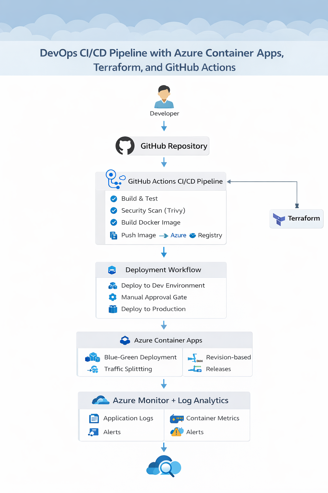
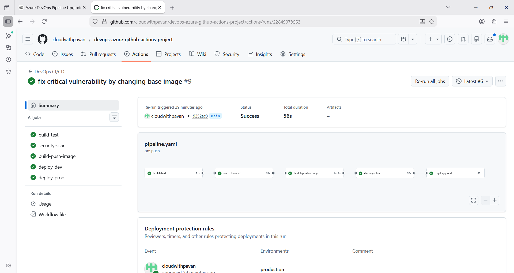
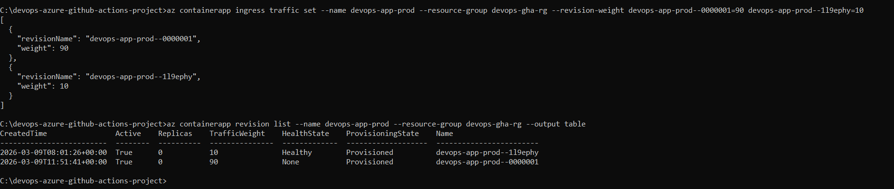
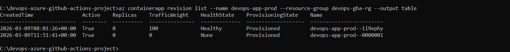
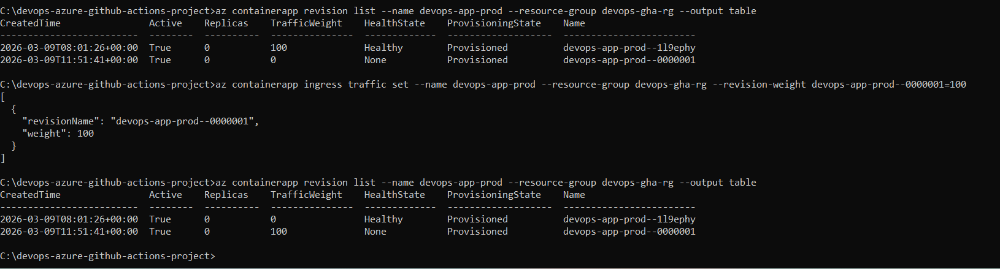

# 🚀 Production-Grade CI/CD Pipeline with GitHub Actions, Terraform, and Azure Container Apps

This project demonstrates a **production-grade DevOps CI/CD pipeline** for deploying a **containerized Node.js application** to Microsoft Azure using modern cloud-native tools.

The pipeline automates the entire application lifecycle:

Code → Build → Security Scan → Containerize → Push → Deploy → Monitor

The platform integrates **CI/CD automation, Infrastructure as Code, container security scanning, blue-green deployment, and monitoring**.

---

# 📌 Project Overview

This project shows how a **Node.js application** can be deployed to Azure using a fully automated DevOps workflow.

Key features implemented:

* Continuous Integration using GitHub Actions
* Continuous Deployment pipeline
* Infrastructure provisioning using Terraform
* Containerized Node.js application using Docker
* Container vulnerability scanning using Trivy
* Blue-Green deployment using Azure Container Apps revisions
* Manual approval gate before production deployment
* Monitoring and logging using Azure Monitor and Log Analytics

---

# 🏗 Architecture Diagram

The following diagram illustrates the end-to-end DevOps architecture used in this project.



---

# ⚙️ Architecture Workflow

```text
Developer
   │
   ▼
GitHub Repository
   │
   ▼
GitHub Actions CI/CD Pipeline
   │
   ├── Build Node.js Application
   ├── Run Tests
   ├── Security Scan (Trivy)
   ├── Build Docker Image
   └── Push Image → Azure Container Registry
   │
   ▼
Deployment Workflow
   │
   ├── Deploy to Dev Environment
   ├── Manual Approval Gate
   └── Deploy to Production
   │
   ▼
Azure Container Apps
   │
   ├── Node.js Container
   ├── Blue-Green Deployment
   ├── Revision-Based Releases
   └── Traffic Splitting
   │
   ▼
Azure Monitor + Log Analytics
   │
   ├── Application Logs
   ├── Container Metrics
   └── Alerts
```

---

# 🧰 Tech Stack

| Technology               | Purpose                     |
| ------------------------ | --------------------------- |
| Node.js                  | Application runtime         |
| Docker                   | Containerization            |
| GitHub Actions           | CI/CD automation            |
| Terraform                | Infrastructure as Code      |
| Azure Container Registry | Container image storage     |
| Azure Container Apps     | Application hosting         |
| Azure Monitor            | Monitoring and metrics      |
| Log Analytics            | Centralized logging         |
| Trivy                    | Container security scanning |

---

# 🔁 CI/CD Pipeline Flow

1️⃣ Developer pushes Node.js code to GitHub

2️⃣ GitHub Actions CI pipeline starts automatically

3️⃣ Application build and tests run

4️⃣ Trivy scans the container image for vulnerabilities

5️⃣ Docker image is built

6️⃣ Image pushed to Azure Container Registry

7️⃣ Application deployed to Dev environment

8️⃣ Manual approval required for Production deployment

9️⃣ Production deployment executed

🔟 Monitoring and logs collected via Azure Monitor

---

# 🔄 CI/CD Pipeline Screenshot

Example successful CI/CD pipeline execution.



---

# 🔵🟢 Blue-Green Deployment Strategy

Azure Container Apps supports **revision-based deployments**, enabling safe releases without downtime.

Traffic can be gradually shifted between versions.

Example traffic distribution:

| Revision       | Traffic |
| -------------- | ------- |
| Stable Version | 90%     |
| New Version    | 10%     |

After validation:

| Revision    | Traffic |
| ----------- | ------- |
| New Version | 100%    |
| Old Version | 0%      |

Rollback can be performed instantly by switching traffic back.

---

# 🔀 Traffic Splitting

Traffic distribution between container revisions.



---

# 🔵🟢 Blue-Green Deployment Screenshot

Example revision-based deployment in Azure Container Apps.



---

# 📊 Monitoring & Observability

Monitoring is implemented using **Azure Monitor** and **Log Analytics**.

Metrics available:

* CPU usage
* Memory usage
* Request metrics
* Replica count

Logs available:

* Node.js application logs
* Container runtime logs
* System logs

Example Log Analytics query:

```
ContainerAppConsoleLogs_CL
| limit 50
```

---

# 📈 Monitoring Dashboard

Example monitoring dashboard for container metrics.



---

# 📦 Infrastructure as Code

Infrastructure resources are provisioned using **Terraform**.

Provisioned resources include:

* Azure Resource Group
* Azure Container Registry
* Azure Container App
* Log Analytics Workspace
* Managed Identity
* RBAC Role Assignments

Terraform state is stored remotely using **Azure Storage backend**.

---

# 📂 Project Structure

```
devops-azure-github-actions-project
│
├── app/
│   ├── Dockerfile
│   └── Node.js application code
│
├── terraform/
│   ├── main.tf
│   ├── variables.tf
│   └── backend.tf
│
├── .github/workflows/
│   └── pipeline.yml
│
├── screenshots/
│   ├── architecture-diagram.png
│   ├── pipeline.png
│   ├── blue-green.png
│   ├── traffic.png
│   └── monitoring.png
│
└── README.md
```

---

# 🔒 Security

Security scanning is implemented using **Trivy**.

The CI pipeline scans Docker images for vulnerabilities and blocks deployment if critical issues are detected.

---

# 🔮 Future Improvements

Potential enterprise improvements:

* Canary deployments
* Automatic rollback on health check failure
* Prometheus and Grafana monitoring
* Multi-region deployments
* GitOps workflow using ArgoCD
* Automated incident alerts

---

# 🤝 Support

If you find this project helpful:

⭐ Star the repository
🍴 Fork the project
🐞 Open issues for improvements

---


# 👨‍💻 Author

## Pavan Kumar Gummadi##

DevOps Portfolio Project

