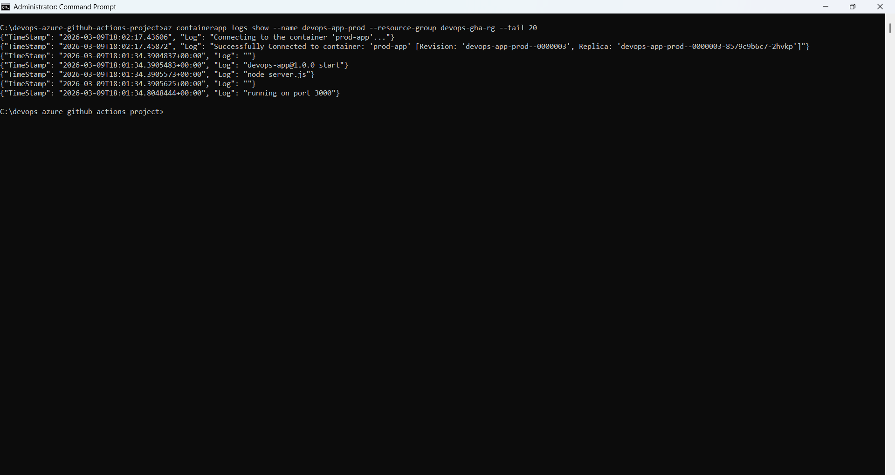
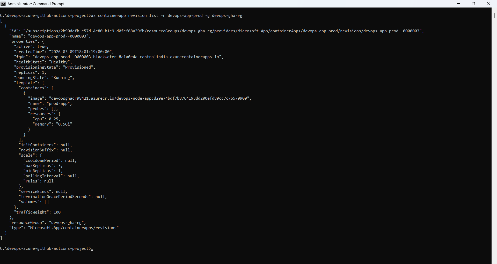
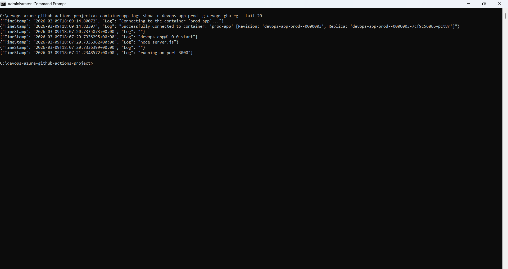
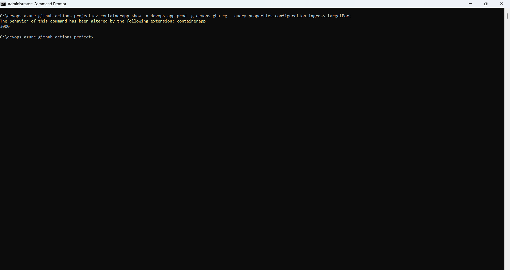
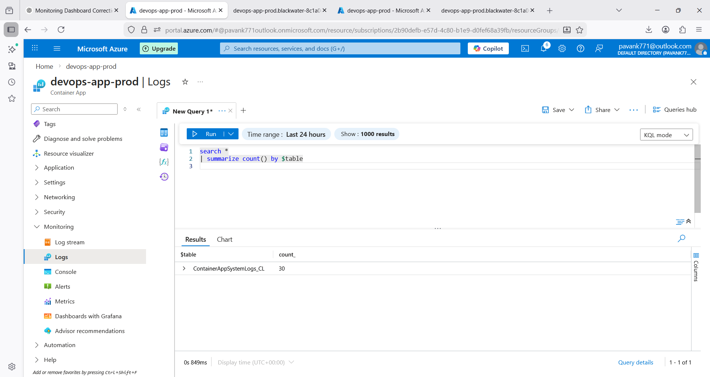
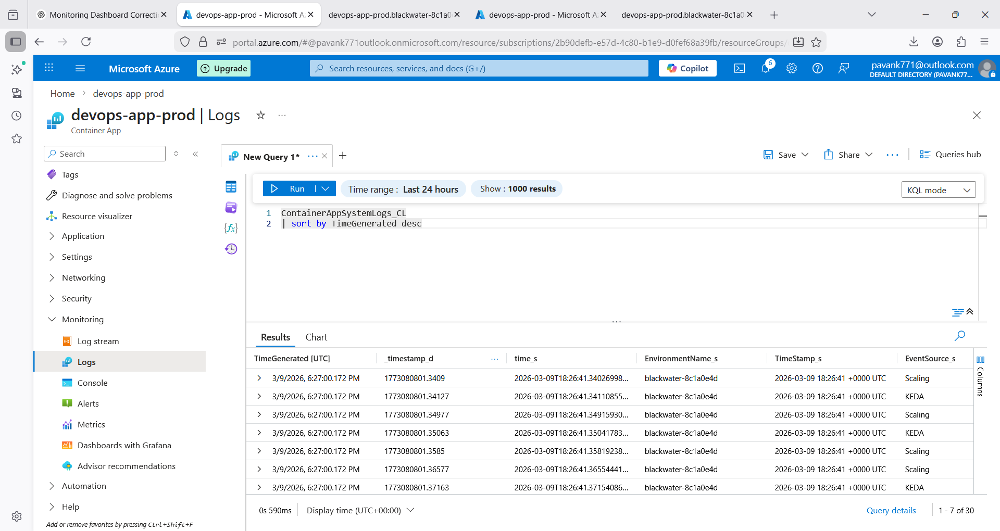
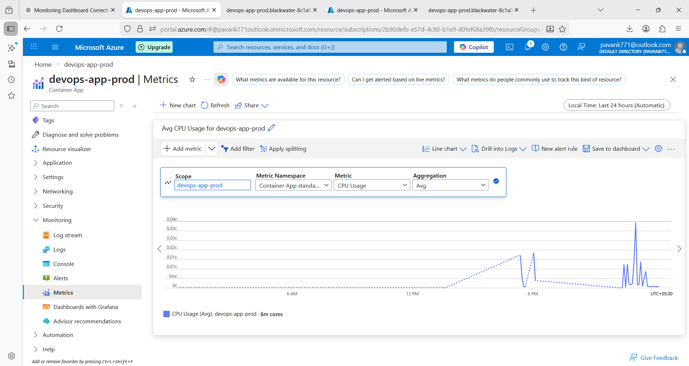

# 🚀 Production-Grade CI/CD Pipeline with GitHub Actions, Terraform, and Azure Container Apps


This project demonstrates a **production-grade DevOps CI/CD pipeline** for deploying a **containerized Node.js application** to Microsoft Azure using modern cloud-native technologies.

The pipeline automates the full application lifecycle:

Code → Build → Security Scan → Containerize → Push → Deploy → Monitor

---

# 📌 Project Overview

This project demonstrates how a **Node.js application** can be deployed using a complete DevOps workflow.

Key features implemented:

* CI/CD automation using GitHub Actions
* Infrastructure provisioning using Terraform
* Containerized Node.js application using Docker
* Container vulnerability scanning using Trivy
* Blue-Green deployment using Azure Container Apps revisions
* Manual approval gate before production deployment
* Monitoring and logging using Azure Monitor and Log Analytics

---

# ⭐ Key DevOps Features

* Automated CI/CD pipeline
* Infrastructure as Code using Terraform
* Container security scanning
* Blue-Green deployment strategy
* Revision-based rollback capability
* Production approval gate
* Monitoring and observability
* Operations runbook

---

# 🌐 Live Application

The application is deployed using **Azure Container Apps**.

Example endpoint format:

https://devops-app-prod.<region>.azurecontainerapps.io

---

# 🏗 Architecture Diagram


---


## ⚙️ Architecture Workflow

```
Developer
   │
   ▼
GitHub Repository
   │
   ▼
GitHub Actions CI/CD Pipeline
   │
   ├── Build Node.js Application
   ├── Run Tests
   ├── Security Scan (Trivy)
   ├── Build Docker Image
   └── Push Image → Azure Container Registry
   │
   ▼
Deployment Workflow
   │
   ├── Deploy to Dev Environment
   ├── Manual Approval Gate
   └── Deploy to Production
   │
   ▼
Azure Container Apps
   │
   ├── Node.js Container
   ├── Blue-Green Deployment
   ├── Revision-Based Releases
   └── Traffic Splitting
   │
   ▼
Azure Monitor + Log Analytics
   │
   ├── Application Logs
   ├── Container Metrics
   └── Alerts
```


           
---

# 🧰 Tech Stack

| Technology               | Purpose                     |
| ------------------------ | --------------------------- |
| Node.js                  | Application runtime         |
| Docker                   | Containerization            |
| GitHub Actions           | CI/CD automation            |
| Terraform                | Infrastructure as Code      |
| Azure Container Registry | Container image storage     |
| Azure Container Apps     | Application hosting         |
| Azure Monitor            | Metrics monitoring          |
| Log Analytics            | Centralized logging         |
| Trivy                    | Container security scanning |

---

# 🔁 CI/CD Pipeline Flow

1️⃣ Developer pushes Node.js code to GitHub

2️⃣ GitHub Actions CI pipeline starts automatically

3️⃣ Application build and tests run

4️⃣ Trivy scans the container image for vulnerabilities

5️⃣ Docker image is built

6️⃣ Image pushed to Azure Container Registry

7️⃣ Application deployed to Dev environment

8️⃣ Manual approval required for Production deployment

9️⃣ Production deployment executed

🔟 Monitoring and logs collected via Azure Monitor

---

# 🔄 CI/CD Pipeline Screenshot


---

# 🔵🟢 Blue-Green Deployment Strategy

Azure Container Apps supports **revision-based deployments**, enabling safe releases without downtime.

Traffic can be gradually shifted between versions.

Example traffic distribution:

| Revision       | Traffic |
| -------------- | ------- |
| Stable Version | 90%     |
| New Version    | 10%     |

After validation:

| Revision    | Traffic |
| ----------- | ------- |
| New Version | 100%    |
| Old Version | 0%      |

Rollback can be performed instantly by switching traffic back.

---

# 🔀 Traffic Splitting


---

# 🔵🟢 Blue-Green Deployment Screenshot


---

# 📊 Monitoring & Observability

Monitoring is implemented using **Azure Monitor** and **Log Analytics**.

Metrics available:

* CPU usage
* Memory usage
* Request metrics
* Replica count

Logs available:

* Node.js application logs
* Container runtime logs
* System logs

Example Log Analytics query:

ContainerAppConsoleLogs_CL
| limit 50

---

# 📈 Monitoring Dashboard

## Container CLI Logs



---

## Container Revision Details



---

## Application Runtime Logs



---

## Container Port Configuration



---

## Log Analytics Tables



---

## Log Analytics Query Results



---

## Azure Monitor Metrics Dashboard



---

# 📦 Infrastructure as Code

Infrastructure resources are provisioned using **Terraform**.

Provisioned resources include:

* Azure Resource Group
* Azure Container Registry
* Azure Container App
* Log Analytics Workspace
* Managed Identity
* RBAC Role Assignments

Terraform state is stored remotely using **Azure Storage backend**.

---

# 📂 Project Structure

devops-azure-github-actions-project

app/
Dockerfile
Node.js application

terraform/
main.tf
variables.tf
backend.tf

.github/workflows/
pipeline.yml

screenshots/
architecture-diagram.png
pipeline.png
blue-green.png
traffic.png

monitoring/
01-container-cli-logs.png
02-container-revision-details.png
03-application-runtime-logs.png
04-container-port-configuration.png
05-log-analytics-tables.png
06-log-analytics-query-results.png
07-container-metrics-dashboard.png

README.md

---

# 🛠 Operations Runbook

## Restart Container App

az containerapp revision restart --name devops-app-prod --resource-group devops-gha-rg

## View Application Logs

az containerapp logs show --name devops-app-prod --resource-group devops-gha-rg

## Check Active Revisions

az containerapp revision list --name devops-app-prod --resource-group devops-gha-rg --output table

## Rollback Deployment

az containerapp ingress traffic set --name devops-app-prod --resource-group devops-gha-rg --revision-weight devops-app-prod-0000001=100

## Monitor Metrics

Key metrics available:

* CPU usage
* Memory usage
* Request rate
* Replica scaling

---

# 🔒 Security

Security scanning is implemented using **Trivy**.

The CI pipeline scans Docker images for vulnerabilities and blocks deployment if critical issues are detected.

---

# 🔮 Future Improvements

Possible enterprise enhancements:

* Canary deployments
* Automatic rollback based on health checks
* Prometheus & Grafana integration
* Multi-region deployment
* GitOps workflow using ArgoCD
* Automated alerting

---

# 🤝 Support

If you find this project helpful:

⭐ Star the repository
🍴 Fork the project
🐞 Open issues for improvements

---

# 👨‍💻 Author

**Pavan Kumar Gummadi**

DevOps Engineer | Cloud & CI/CD Enthusiast

GitHub
https://github.com/cloudwithpavan

Email
[pavan7071@gmail.com](mailto:pavan7071@gmail.com)

